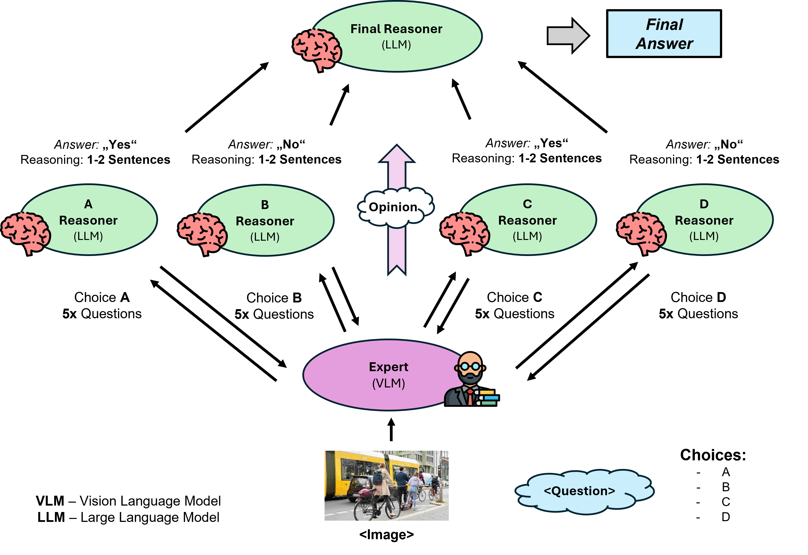

# Visual Reasoning Project



## Overview

This repository contains the codebase for the "Visual Reasoning Project," which leverages both Large Language Models (LLMs) and Visual Language Models (VLMs) to enhance the understanding and interpretation of complex visual data. The goal is to improve performance in visual reasoning tasks, employing a novel architecture for dynamic interaction between LLMs and VLMs without fine-tuning.

## Project Files Description

- **Constants.py** - Contains global constants used across the project, such as paths to data and configuration for inference servers.
- **LLama_model.py** - Implements functions to interact with the LLaMA model for text-based inferences.
- **Llava_model.py** - Manages interactions with the LLaVA model for image-based inferences and reasoning.
- **main.py** - The main executable script that integrates all components, processes data, and orchestrates the flow of information and reasoning across different models.
- **prepare_data.py** - Prepares and batches data for processing by the LLMs, handling dataset input and output.
- **generate_content.py** - Contains functions to generate prompts and manage the generation of subquestions and conclusions based on model interactions.
- **prompts.py** - Defines various prompt templates used for generating content and guiding model interactions.
- **DS_report-2-2.pdf** - A detailed project report explaining the methodology, the architecture of the solution, and performance analysis.

## Installation

1. Clone this repository to your local machine:
   ```bash
   git clone https://github.com/drichter98/Visual-Reasoning-Project.git
   ```
2. Navigate to the repository directory:
   ```bash
   cd your-repository
   ```
3. Install required packages (ensure you have Python installed):
   ```bash
   pip install -r requirements.txt
   ```

## Usage

To run the main processing script:
   ```bash
   python main.py
   ```

Ensure you have the necessary data in the specified directories as per the `Constants.py` file settings.

## Authors

- Imene Ben Ammar
- Anton Segeler
- Omadbek Meliev
- Daniel Richter
